# WeatherBug - Android Weather App

<div align="center">
  
  
  
</div>

## 📱 About

**WeatherBug** is a comprehensive and interactive Android weather application. The app provides real-time weather updates, accurate hourly and daily forecasts, customizable alerts, and an elegant UI with dark/light mode support using Modern Android Development (MAD) practices. 

## ✨ Features

- 📍 **Real-Time Location Weather** - Get current weather conditions for your precise location
- 🌍 **Map Picker & Search** - Select and save favorite locations via Google Maps or city search
- ⏱️ **Weather Alerts** - Schedule custom background notifications for specific weather conditions
- 🎨 **Beautiful UI (Compose)** - Fully built with Jetpack Compose featuring Light & Dark themes
- 📴 **Offline Support** - View saved favorite locations and cached weather data without internet
- 🗺️ **Multi-Language & Units** - Support for multiple languages (e.g., English, Arabic) and measurement units (Metric, Imperial, Standard)

## 🛠️ Technologies Used

- **UI Framework**: [Jetpack Compose](https://developer.android.com/jetpack/compose)
- **Architecture**: MVVM (Model-View-ViewModel) + Clean Architecture principles
- **Asynchrony & Reactive**: Coroutines & Kotlin Flow
- **Dependency Injection**: [Koin](https://insert-koin.io/)
- **Network**: [Retrofit](https://square.github.io/retrofit/) & OkHttp + [OpenWeatherMap API](https://openweathermap.org/)
- **Local Database**: [RoomDatabase](https://developer.android.com/training/data-storage/room)
- **Key-Value Storage**: [DataStore Preferences](https://developer.android.com/topic/libraries/architecture/datastore)
- **Background Processing**: [WorkManager](https://developer.android.com/topic/libraries/architecture/workmanager)
- **Location Services**: FusedLocationProviderClient & Google Maps SDK

## 📸 Screenshots

### Splash & Onboarding
<p align="center">
  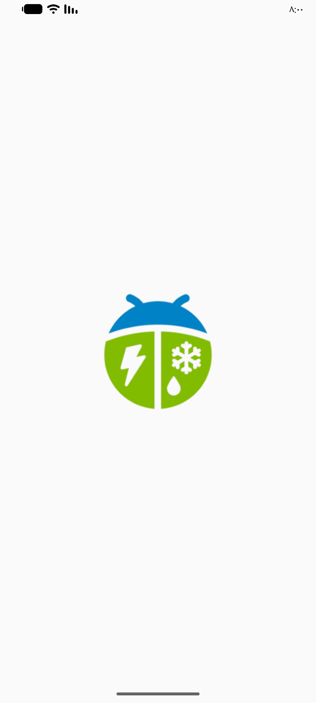
  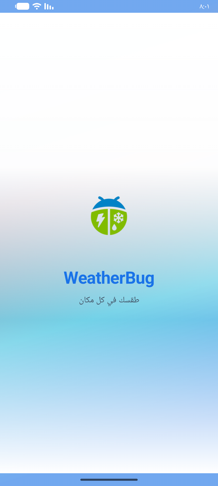
  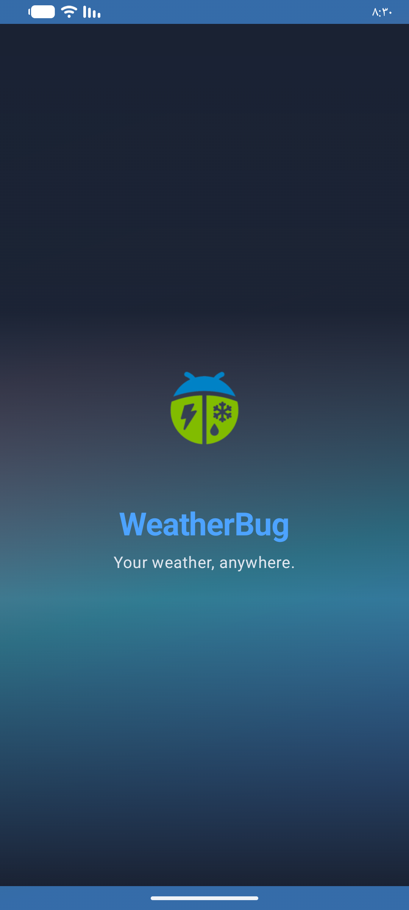
</p>
*Native Splash Screen and App Splash Screen (Light & Dark)*

### Home Screen
<p align="center">
  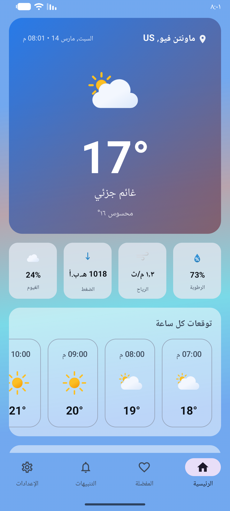
  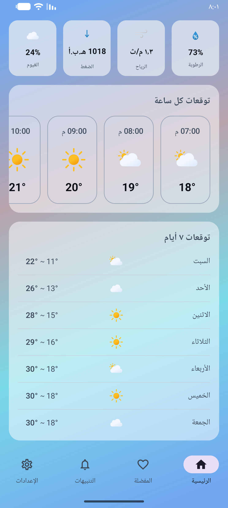
  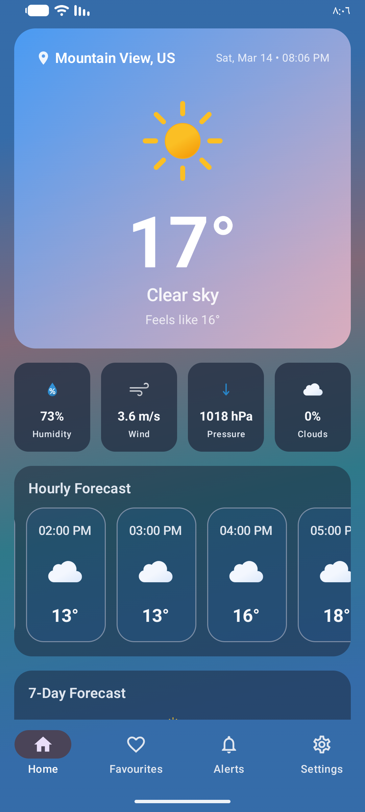
  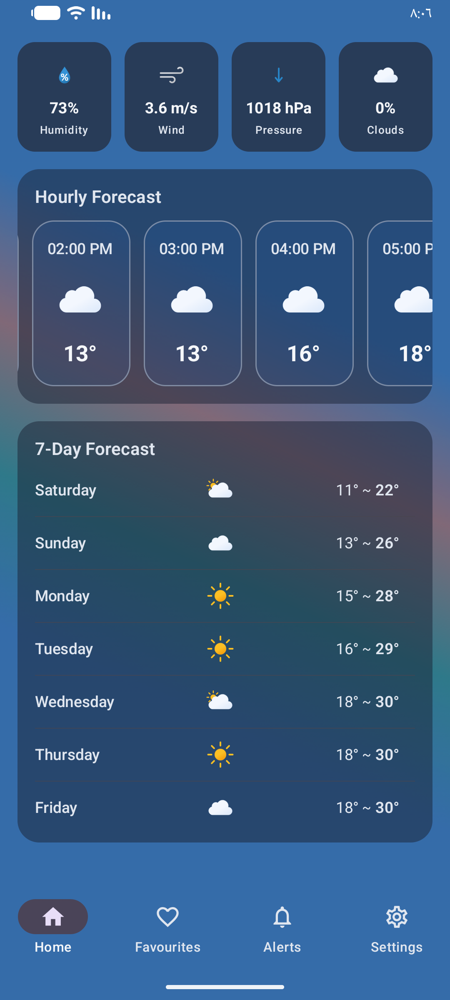
</p>
*Home screen showing current weather, hourly, and daily forecasts in Light and Dark modes*

### Location & Map Picker
<p align="center">
  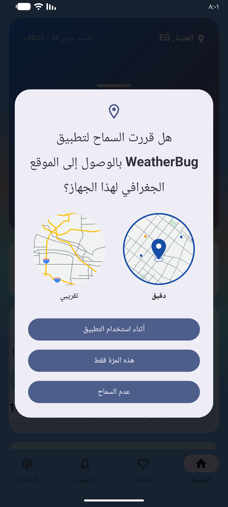
  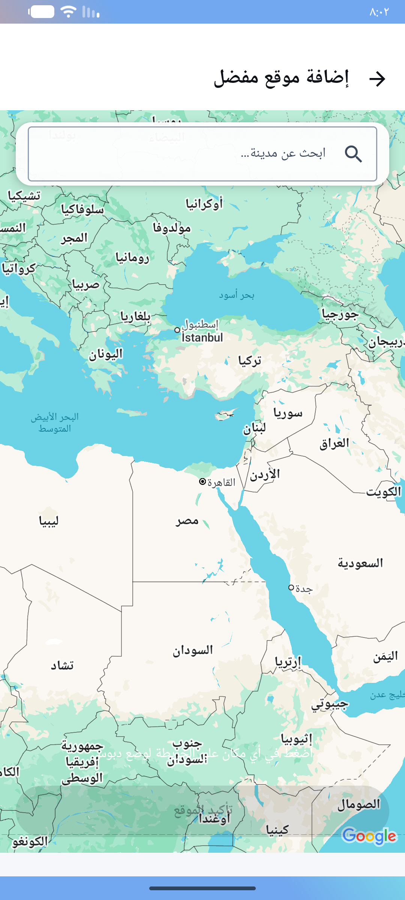
  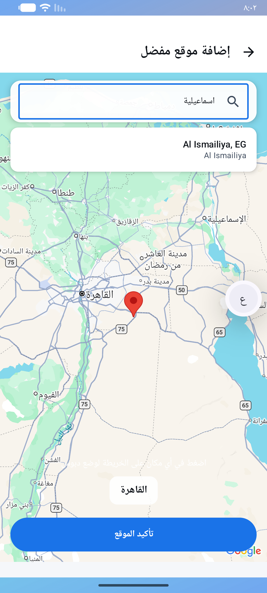
  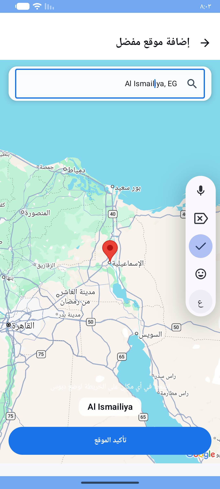
</p>
*Location Permission, Map Picker, Location Search, and PIN Selection*

### Favourites
<p align="center">
  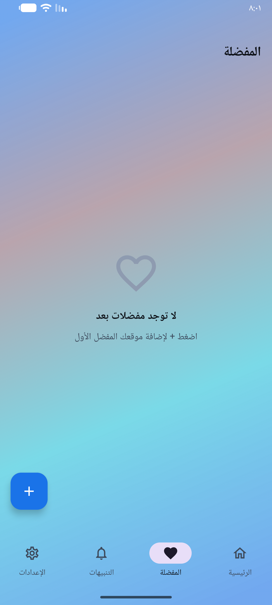
  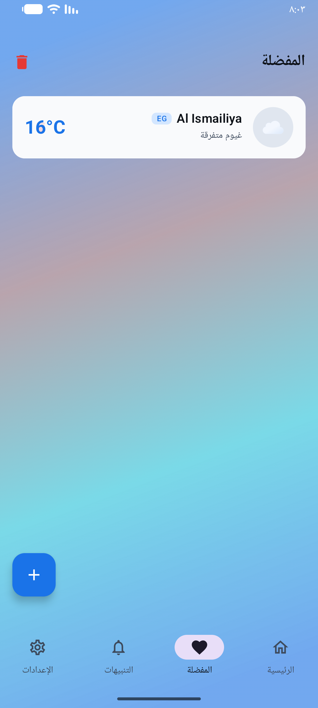
  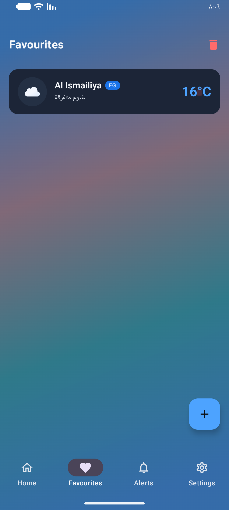
  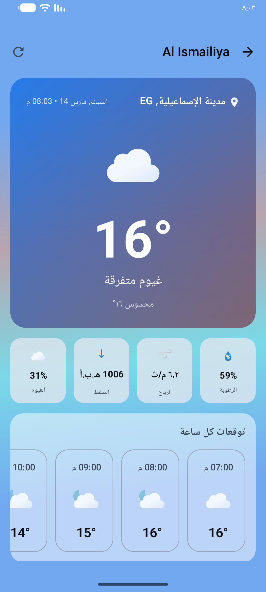
</p>
*Empty State, Favourites List (Light & Dark), and Details Screen*

### Alerts
<p align="center">
  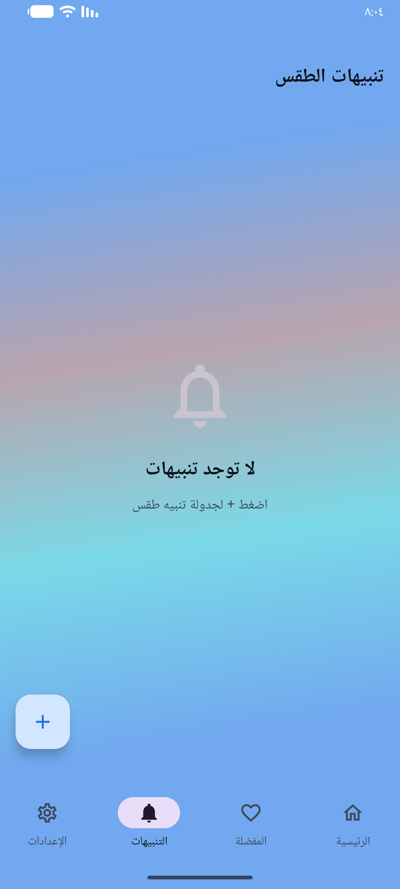
  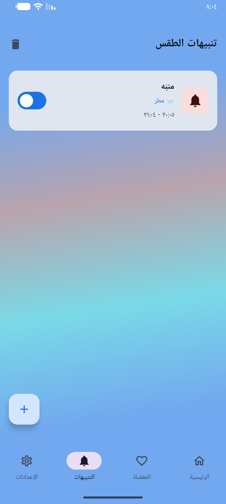
  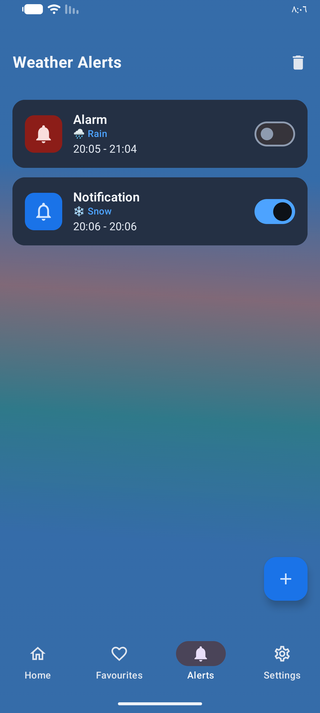
  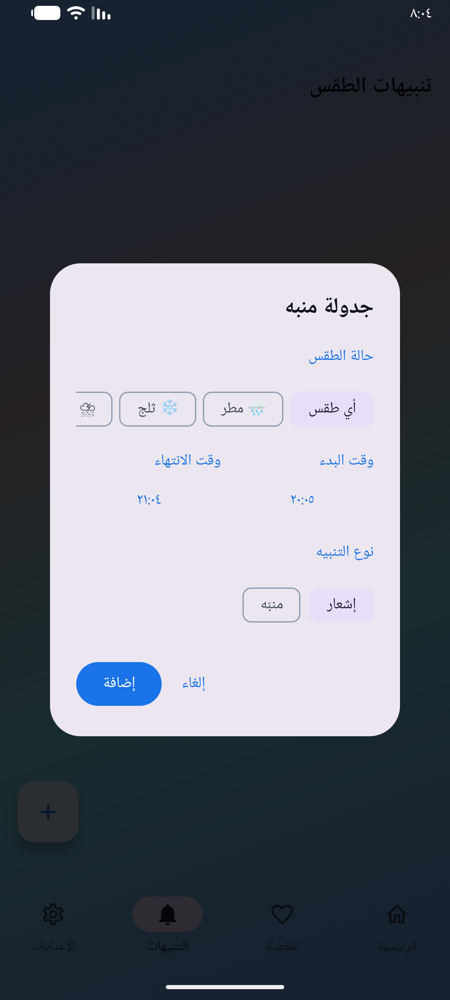
</p>
*List empty state, Alerts List (Light & Dark), and Scheduling New Alert*

### Settings
<p align="center">
  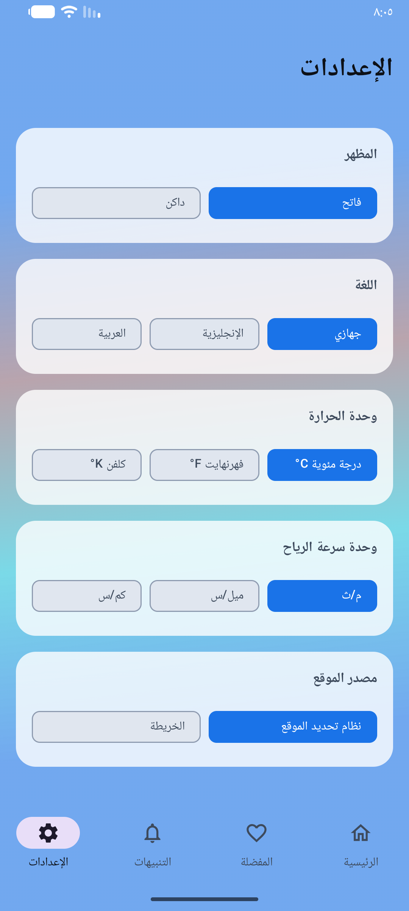
  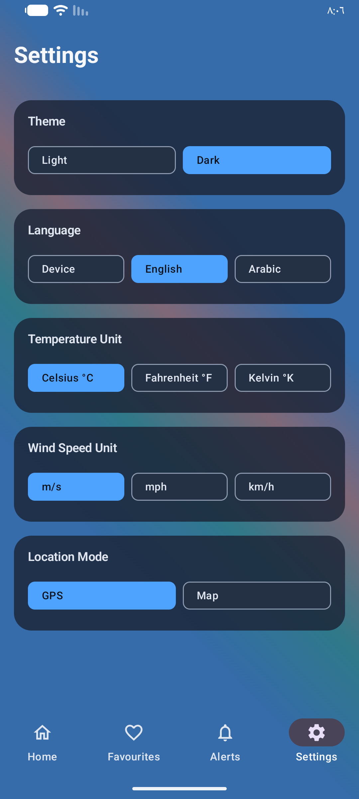
</p>
*Extensive app configuration (Language, Units, Theme, Location Mode)*

## 🌐 API Integration

This project uses the [OpenWeatherMap API](https://openweathermap.org/) to fetch real-time weather data and forecast information. The integration features:
- **Current Weather Data**: Fetches the latest weather metrics based on GPS or picked location.
- **5 Day / 3 Hour Forecast**: Processes standard forecast data to display daily & hourly forecasts seamlessly.
- **Geocoding API**: Resolves searched city names into precise coordinates and vice-versa.

*Note: You will need your own API Key from OpenWeatherMap to make live requests.*

## 🚀 Getting Started

### Prerequisites

- Android Studio (Jellyfish or higher recommended)
- Java Development Kit (JDK) 11+
- Android SDK 34+
- An Android device/emulator (API 24 or higher)

### Installation

1. **Clone the repository**
   ```bash
   git clone https://github.com/ahmedelkady757/WeatherBug.git
   cd WeatherBug
   ```

2. **Setup API Key**
   - Provide your OpenWeatherMap API key inside the project properties or constants as defined by the application architecture.

3. **Build and run the app**
   - Open the project in Android Studio.
   - Sync Gradle.
   - Run the app on your emulator or physical device.
